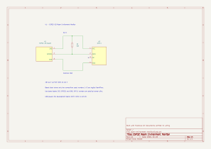

# ESP32 Room Environment Monitor

An embedded-systems portfolio project for Computer Engineering, built progressively with an ESP32-S3 and the Freenove starter kit.

## V1: temperature and humidity over Serial

V1 reads a DHT11 and prints temperature in Celsius, temperature in Fahrenheit, and relative humidity. Measurement attempts are scheduled every 2,000 ms using `millis()`. Failed readings print the library's error message instead of measurements. The next scheduled attempt can recover when the sensor responds again.

`loop()` controls timing; `readEnvironment()` handles the sensor read, error check, Fahrenheit conversion, and Serial output. The Fahrenheit conversion is calculated in the sketch as `(C * 1.8) + 32`.

## Hardware and wiring

- Freenove ESP32-S3 development board
- DHT11 temperature/humidity sensor
- 10 kΩ pull-up resistor
- Breadboard, jumper wires, and USB cable

| DHT11 connection | Connection in this build |
| --- | --- |
| Pin 1: VCC | Board 3.3 V |
| Pin 2: DATA | ESP32-S3 GPIO 21 |
| Pin 3: NC | Unconnected |
| Pin 4: GND | Breadboard ground rail connected to board GND |
| 10 kΩ resistor | Between DATA/GPIO 21 and 3.3 V |

The resistor holds the data line high when it is idle. Although the tutorial schematic labels the data pin SDA, the DHT11 uses its own digital protocol, not I2C. No ADC input is used in V1.

Power off before changing wiring. Follow the sensor pin numbering in the kit diagram rather than assuming a physical orientation from this table.

## V1 schematic



[Editable KiCad project](HardWare/room-environment-monitor/room-environment-monitor.kicad_pro) | [PDF schematic](HardWare/room-environment-monitor/room-environment-monitor.pdf)

This project-specific diagram was generated with Codex from the builder-confirmed wiring. The ESP32-S3 block shows only the three board connections used; its logical pin identifiers are not physical header positions. The DHT11 pin numbers match the kit wiring reference. KiCad electrical-rule checks reported zero errors or warnings, and exported connectivity was checked against the wiring table. The symbols use passive pin types for wiring documentation, so ERC does not validate voltage compatibility or sensor behavior. No PCB layout or footprint assignments are provided.

## Software and setup

1. Open `Second_Project.ino` in Arduino IDE. Keep the sketch inside the `Second_Project` folder.
2. Install ESP32 board support and the DHTesp library used in the Freenove tutorial.
3. Select the board configuration and USB port that worked for the ESP32-S3 kit tutorials.
4. Upload the sketch and open Serial Monitor at **115200 baud**.
5. Expect the startup message, followed by measurement output approximately every two seconds. The first measurement attempt occurs after the initial interval.

Illustrative output, not a recorded measurement:

```text
 Temperature:25.00°C Temperature Fahrenheit:77.00°F Humidity:50.00%
```

The exact board-menu configuration and installed library version have not yet been recorded.

## Hardware validation

The builder reported these results during V1 development:

| Check | Result |
| --- | --- |
| Upload and normal sensor readings | Passed |
| Celsius, Fahrenheit, and humidity output | Reported working |
| Refactor into readEnvironment() | Uploaded and reported working |
| millis() scheduling | Uploaded and reported working |
| Data wire disconnected | Serial reported timeout on the refactored version |

These are builder-reported hardware results. No automated compilation, independently recorded timing measurements, accuracy calibration, or long-duration testing was performed as part of documentation preparation. A dedicated reconnect/recovery test has not yet been recorded.

To repeat the failure test, power off, disconnect the data wire, restart, and check for an error. Power off again, reconnect DATA, and restart to check that measurements return.

## Design decisions and limitations

- Schedule attempts with `millis()` instead of a two-second blocking delay.
- Update the attempt timestamp before reading, so failures also respect the interval.
- Use unsigned elapsed-time subtraction so the timing check handles millis() rollover.
- Keep variables local when only needed for one measurement attempt.
- Check the DHTesp status before converting or printing measurements.
- The sensor transaction itself still takes time; millis() scheduling does not make the library read asynchronous.
- Sensor output formatting does not imply measurement accuracy or precision.
- V1 does not store measurements or display stale values after an error.

## Planned progression

- **V1:** DHT11 to Serial Monitor — implemented and hardware tested as described above
- **V2:** Add LCD1602 output
- **V3:** Add environmental LED status indicators
- **V4:** Add PIR motion/occupancy status
- **V5:** Add Wi-Fi and a browser dashboard

Only V1 is currently implemented. A project-specific V1 schematic is included above; build photos will be added later.

## References and attribution

The starting sensor example and wiring reference came from the **Freenove ESP32-S3 Ultimate Starter Kit tutorial**. The tutorial schematic was supplied as a reference and is not an original diagram for this project; it has not been redistributed here.

Project changes include Fahrenheit conversion, readable error reporting in place of a goto retry loop, millis() scheduling, and organization into a measurement function.

Sensor interface: [DHTesp library and documentation](https://github.com/beegee-tokyo/DHTesp).
