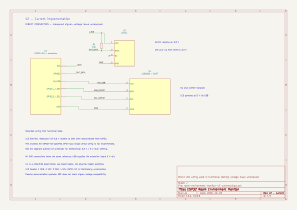
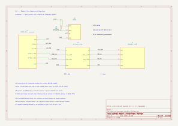
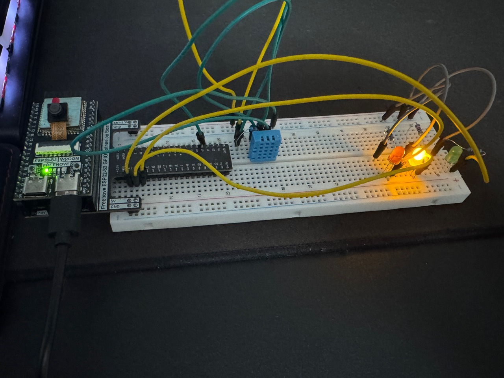
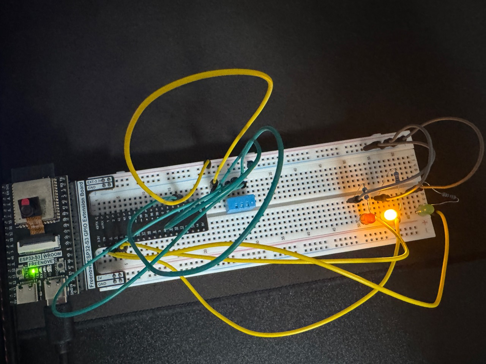

# ESP32 Room Environment Monitor

I'm building this project as part of my embedded-systems portfolio for Computer Engineering. I started with the Freenove ESP32-S3 kit tutorials and am developing the monitor one version at a time to practice sensor interfacing, debugging, timing, and code organization.

**Current milestone: V4 motion and occupancy estimate — October 10, 2026.** I added the HC-SR501 PIR sensor and tested motion-change reporting, a non-blocking warm-up period, and an occupancy timeout on my board. Temperature, humidity, and the environmental LEDs continue working. The LCD remains removed while its level-shifter integration is pending; its initialization and display calls are still commented out.

## V1: temperature and humidity over Serial

For V1, I connected a DHT11 sensor and printed temperature in Celsius, temperature in Fahrenheit, and relative humidity to Serial Monitor. I calculate Fahrenheit in the sketch using `(C * 1.8) + 32`.

I use `millis()` to schedule measurement attempts every 2,000 ms. If a reading fails, the program prints the library's error message and waits until the next scheduled attempt before trying again.

I separated the measurement work into `readEnvironment()`. The main `loop()` decides when to call it, while the function reads the sensor, checks its status, calculates Fahrenheit, and prints the results.

## Hardware and wiring

For V1, I used:

- Freenove ESP32-S3 development board and GPIO extension board
- DHT11 temperature/humidity sensor
- 10 kΩ pull-up resistor
- Breadboard, jumper wires, and USB cable

| DHT11 connection | My wiring |
| --- | --- |
| Pin 1: VCC | Board 3.3 V |
| Pin 2: DATA | ESP32-S3 GPIO 21 |
| Pin 3: NC | Unconnected |
| Pin 4: GND | Breadboard ground rail connected to board GND |
| 10 kΩ resistor | Between DATA/GPIO 21 and 3.3 V |

The pull-up resistor holds the data line high when it is idle. Although the tutorial diagram labels the sensor data pin SDA, the DHT11 uses its own digital protocol, not I2C. I don't use an ADC input for this sensor.

Power off before changing wiring, and use the kit's sensor pin diagram to identify the physical pins.

## V1 schematic


[Editable KiCad project](HardWare/room-environment-monitor/room-environment-monitor.kicad_pro) | [PDF schematic](HardWare/room-environment-monitor/room-environment-monitor.pdf)

## Software and setup

To run the project:

1. Open `Second_Project.ino` in Arduino IDE. Keep the sketch inside the `Second_Project` folder.
2. Install ESP32 board support, DHTesp, and the kit's LiquidCrystal I2C library. The current sketch still includes the LCD library even though LCD communication is temporarily disabled.
3. Select the board configuration and USB port used for the ESP32-S3 kit tutorials.
4. Upload the sketch and open Serial Monitor at **115200 baud**.
5. Check for the startup message, followed by measurements approximately every two seconds. The first reading is scheduled after the initial interval.
6. Allow 60 seconds for PIR warm-up. The first PIR level then prints once, followed by messages when motion or occupancy state changes.

Example Serial output:

```text
 Temperature:25.00°C Temperature Fahrenheit:77.00°F Humidity:50.00%
```

This is an example of the output format, not a saved measurement. I still need to record the exact board-menu configuration. The installed LiquidCrystal I2C library is version 1.1.2; its AVR architecture warning appeared during compilation, but I successfully uploaded and tested the LCD code on my ESP32-S3. I haven't recorded the DHTesp or ESP32 board-package versions yet.

The current sketch runs the DHT11, Serial output, environmental status LEDs, and V4 PIR motion/occupancy logic. The V2 LCD code is retained but disabled while the display is removed. Before restoring the LCD, read the voltage investigation below. The V1 and V2 schematics record those earlier circuits; the V3 LED and V4 PIR wiring are documented in their own tables below.

## V1 testing

I uploaded and tested V1 on my board:

| Test | Result |
| --- | --- |
| Normal sensor readings | Working |
| Celsius, Fahrenheit, and humidity output | Working |
| Refactor into readEnvironment() | Uploaded and working |
| millis() scheduling | Uploaded and working |
| Disconnected DHT11 data wire | Serial printed timeout on the refactored version |

I tested the behavior directly on the hardware. I haven't done sensor accuracy calibration, precise timing measurements, automated build checks, or long-duration testing. I haven't recorded a separate V1 reconnect/recovery test.

To repeat the failure test, power off, disconnect DATA, restart, and check for an error. Power off again before reconnecting DATA, then restart and check that readings return.

## Design decisions and limitations

- I use `millis()` instead of a two-second `delay()` so the program can do other work between measurement attempts.
- I update the attempt timestamp before reading, so failed attempts also respect the interval.
- I use unsigned elapsed-time subtraction to handle millis() rollover.
- I keep measurement variables local to the functions that use them.
- I check the sensor status before converting or printing measurements.
- The sensor transaction still takes time; scheduling with millis() doesn't make the library call asynchronous.
- Printing decimal places doesn't establish the sensor's accuracy or precision.
- I don't store a history of measurements. Failed reads print an error instead of measurements. In V2, they also replaced the LCD readings with an error message; in the current build, they select the red LED while the LCD is disabled.

## V2: LCD development and voltage investigation

I added an I2C LCD1602 while keeping the Serial output. I tested Celsius and Fahrenheit on the first row, humidity on the second, and the messages "Sensor error" and "Check Wiring" when the DHT11 reading fails. My error handler clears both rows before printing its messages. I still need to add padding to normal measurement updates so shorter values fully replace previous text.

I used address **0x27**, SDA on **GPIO 14**, and SCL on **GPIO 13**. Following the Freenove tutorial, I initially powered the LCD from the extension board's USB-supplied **5 V** and connected it to the board's GND.

### V2 schematic: previously tested direct wiring



[Editable current V2 KiCad project](HardWare/room-environment-monitor-v2-current/room-environment-monitor-v2-current.kicad_pro) | [PNG diagram](HardWare/room-environment-monitor-v2-current/room-environment-monitor-v2-current.png)

This diagram records the direct 5 V LCD connection I used during functional testing, without a level shifter. I measured the disconnected LCD signal pins near 5 V afterward, so I am documenting this circuit with its unresolved voltage issue rather than treating it as electrically validated. The separate schematic below shows my planned correction.

### Planned V2 schematic



[Editable V2 KiCad project](HardWare/room-environment-monitor-v2/room-environment-monitor-v2.kicad_pro) | [PNG diagram](HardWare/room-environment-monitor-v2/room-environment-monitor-v2.png)

This diagram shows my planned hardware correction, including the level shifter I still need to install. It is not a record of a completed build. The V1 schematic remains available above.

### Voltage measurements

With the LCD powered at 5 V and its SDA/SCL wires disconnected from the ESP32, I measured approximately **4.9-5.0 V** on those signals relative to GND. I then tried powering the LCD from 3.3 V. The signals measured approximately **3.3 V**, but the display did not show text.

I'm still learning to use the multimeter, so measurement error is possible. I haven't independently verified the readings or checked the meter's accuracy. However, the voltage change followed the module's supply voltage, which is consistent with pull-up resistors connected to that supply. I can't assume the readings are harmless or dismiss them as an error without further testing.

The [ESP32-S3 datasheet, Table 5-4](https://documentation.espressif.com/esp32-s3_datasheet_en.pdf) specifies a high-level input maximum of VDD + 0.3 V, approximately **3.6 V** with a 3.3 V GPIO supply. My measured 5 V signals exceed that specification. Seeing the display work doesn't confirm that the direct connection is electrically compatible.

### Next hardware step

V2's display functionality has been tested, but I still need to resolve the signal-voltage issue. I ordered a **bidirectional I2C level shifter** for the 3.3 V ESP32 side and the 5 V LCD side. I removed the LCD for the V3 LED tests. The shifter is not installed yet, and I haven't tested the corrected LCD interface. SDA and SCL should remain disconnected from the ESP32 until the interface is corrected.

After adding the shifter, I need to measure both sides of the bus and repeat the display, sensor-error, and recovery tests.

The current temperature-row layout is intended for readings below **100 °F**. Higher readings need a shorter layout to fit within the LCD's 16 columns.

## V3: environmental LED status indicators

For this milestone, I added green, yellow, and red LEDs while keeping the DHT11 readings and Serial output. Each LED has its own 220 ohm series resistor. I tested the LEDs individually before connecting their behavior to the sensor readings.

### LED wiring

| LED | ESP32-S3 GPIO | Connection |
| --- | --- | --- |
| Green | 4 | GPIO 4 -> 220 ohm resistor -> anode; cathode -> GND |
| Yellow | 5 | GPIO 5 -> 220 ohm resistor -> anode; cathode -> GND |
| Red | 6 | GPIO 6 -> 220 ohm resistor -> anode; cathode -> GND |

The LEDs and DHT11 share the board's GND. My DHT11 wiring remains the same as V1. The LCD is absent from this build.

### Status logic

I set the temperature limits to **20-26 degrees Celsius** and the humidity limits to **30-60% relative humidity**. Both endpoints count as within range. These are adjustable project thresholds, not a calibrated assessment of room conditions.

| Sensor result | Green | Yellow | Red |
| --- | --- | --- | --- |
| Valid reading; both measurements within range | ON | OFF | OFF |
| Valid reading; either measurement outside range | OFF | ON | OFF |
| Failed reading | OFF | OFF | ON |

All three LEDs start off until the first measurement attempt. I check the sensor status before comparing measurements, so a failed read selects red instead of being treated as an environmental warning.

I moved the repeated LED writes into `ledControl(bool greenOn, bool yellowOn, bool redOn)`. Its parameters are ordered green, yellow, red. Each status call sets all three outputs, so an LED from the previous status doesn't stay on. `readEnvironment()` still handles the sensor check and range decisions, while `loop()` schedules measurement attempts with `millis()`.

### Hardware testing

I uploaded the sketch and tested these behaviors on my ESP32-S3:

| Test | Result |
| --- | --- |
| Green, yellow, and red LEDs tested individually | Each LED worked; Serial readings continued |
| Within-range reading | Green only |
| Reading outside either configured range | Yellow only |
| Disconnected DHT11 DATA | Red only, with the sensor error in Serial |
| DATA reconnected and board restarted | Normal readings and the appropriate valid-reading indicator returned |
| Refactor into ledControl() | Uploaded and repeated the green, yellow, and red tests successfully |

During testing, a reading of **22.9 degrees Celsius and 64% humidity** selected yellow because humidity exceeded 60%. I temporarily raised `maxHumidity` to 70 to test green, then restored it to 60. Changing the limit let me test the decision without replacing the sensor's measurements with made-up values.

These are manual functional tests. I haven't tested every exact threshold boundary, millis() rollover on hardware, sensor accuracy, or long-duration operation. There is no hysteresis yet, so readings that cross a threshold repeatedly can switch between green and yellow. Reconnecting DATA with a restart verifies recovery after restart; it doesn't establish recovery without restarting.

### Build photos



My ESP32-S3, DHT11, and three status LEDs during V3 testing. The yellow status LED is lit; the LCD is removed while its level-shifter integration is pending.



A second view of the physical breadboard build. The photos document the assembly; the wiring tables record the GPIO assignments and resistor values.

The LED milestone is complete. My next hardware step is to install the level shifter, restore the LCD, and repeat testing with the display and LEDs together.

## V4: PIR motion and occupancy estimate

I added the kit's HC-SR501 PIR motion sensor while keeping the DHT11, Serial output, and environmental LEDs working. I developed this version with the LCD removed while I wait to complete its level-shifter integration.

### PIR wiring

| HC-SR501 connection | My wiring |
| --- | --- |
| VCC / + | Extension board's USB-supplied 5 V |
| OUT / S | ESP32-S3 GPIO 7 |
| GND / - | Board GND, shared with the DHT11 and LEDs |

I identify the module pins from their labels and the kit diagram, rather than assuming a left-to-right order. The module uses 5 V power and provides an approximately 3.3 V HIGH output, as described in [Freenove's HC-SR501 documentation](https://docs.freenove.com/projects/fnk0082/en/latest/fnk0082/codes/Python/25_Infrared_Motion_Sensor.html). I read OUT with `digitalRead()`; the PIR needs no additional library or ADC conversion.

### Timing and state logic

| Setting | Current value | Purpose |
| --- | --- | --- |
| `readInterval` | 2,000 ms | Schedule DHT11 measurement attempts |
| `pirWarmupInterval` | 60,000 ms | Suppress PIR and occupancy reporting during startup |
| `occupancyTimeout` | 15,000 ms | Keep the occupancy estimate true after the last sampled HIGH |

I set `pirStartTime` in `setup()`. During warm-up, `readMotion()` returns immediately, so temperature, humidity, and LED updates continue without a 60-second `delay()`.

I call `readMotion()` on each pass through `loop()`, outside the two-second DHT timing condition. Motion polling is independent of that interval, although a sensor transaction or Serial output can still take time. This is polling, not interrupt-based event capture.

`previousMotionState` starts at -1 so the first PIR reading after warm-up prints once. Later, I print `PIR: 0` or `PIR: 1` only when the level changes.

When the PIR is HIGH, I set `occupied` to true and refresh `lastMotionTime` on every HIGH reading. When it is LOW, I keep the previous occupancy estimate until 15 seconds have elapsed since the last sampled HIGH. New HIGH readings refresh the timer. I capture the old occupancy value before updating it, then print an occupancy message only if the value changed.

An illustrative sequence of motion messages is:

```text
PIR: 1
Occupancy: Occupied
PIR: 0
Occupancy: No Recent Movement
```

The last line appears after the software timeout; it is not printed immediately with `PIR: 0`. Temperature and humidity messages continue between these events. This example shows the format, not a captured Serial log. If the first PIR reading is LOW, only `PIR: 0` prints initially because `occupied` already starts false.

### Hardware testing

I uploaded and tested the motion and occupancy behavior on my ESP32-S3:

| Test | Result |
| --- | --- |
| PIR motion and return to LOW | Both 1 and 0 observed |
| `readMotion()` refactor and motion-change reporting | Working; PIR messages print on level changes |
| 60-second warm-up | Environmental readings and LEDs continue; PIR reporting begins after warm-up |
| HIGH after warm-up | Occupancy becomes true and prints once |
| LOW before the software timeout | Occupancy stays true |
| LOW through the 15-second software timeout | Occupancy clears and prints once |
| HIGH returns before the timeout expires | Timer refreshes and occupancy stays true |

During the earlier raw-input test, I estimated that the PIR took about 40-60 seconds to return LOW after activity. I did not time that precisely. The module's own hold time and my software timeout are separate: the software keeps occupancy true for about 15 seconds after the output goes LOW. I haven't recorded the potentiometer positions or H/L jumper setting yet.

### Limitations and next steps

This is an occupancy estimate based on recent PIR activity. A stationary person may stop triggering the sensor, so I use the message "No Recent Movement" instead of claiming that the room is empty. A LOW reading also doesn't distinguish no activity from a disconnected or failed PIR signal.

These are manual functional tests. I haven't measured response latency, checked long-duration operation or millis() rollover on hardware, or calibrated detection coverage. PIR reporting is suppressed during warm-up, so startup should not be interpreted as a confirmed empty-room state.

The V4 motion/occupancy milestone is complete. I still need to add photos of this version and update the combined schematic. The existing build photos above show V3 and do not show the PIR. LCD integration and combined display testing remain pending the level shifter.

## Planned progression

- **V1:** DHT11 to Serial Monitor — completed and hardware tested as described above
- **V2:** LCD1602 output — functionality tested; voltage-interface correction and electrical validation pending
- **V3:** Environmental LED status indicators — LED/Serial milestone completed and hardware tested; LCD restoration pending
- **V4:** PIR motion/occupancy estimate — completed and hardware tested as described above
- **V5:** Wi-Fi and a browser dashboard

I've added photos of the V3 breadboard build above. I'll add V4 photos and update the schematic for the combined sensor, PIR, LED, and LCD build as the hardware develops.

## References and attribution

I used the **Freenove ESP32-S3 Ultimate Starter Kit tutorial** as the starting point for the sensor code and wiring. The tutorial schematic was a reference; I haven't redistributed it in this repository.

My changes include calculating Fahrenheit, replacing the goto retry loop with error reporting, using millis() scheduling, separating the work into functions, adding LCD measurements and error messages, selecting LED status indicators from sensor validity and configurable thresholds, and adding PIR state-change reporting with a non-blocking warm-up and occupancy timeout.

Libraries:

- [DHTesp](https://github.com/beegee-tokyo/DHTesp)
- [LiquidCrystal I2C](https://github.com/marcoschwartz/LiquidCrystal_I2C)
